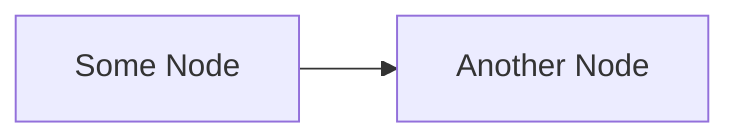

# Heading 1

## Heading 2

### Heading 3

#### Heading 4

##### Heading 5

###### Heading 6

1. Item 1
2. Item 2
3. Item 3

- Bullet 1
- Bullet 2
- Bullet 3

1. Parent item
    1. Child item
        1. Grandchild item

- Parent item
    - Child item
        - Grandchild item

Some text.

**Bold text.**

*Italics text*

_Also italics._

~~Strikethrough~~

***

| A | B | C |
| :- | - | -: |
| a | b | c |
| d | e | f |

`Inline code.`

```
Block of code
```

```js
// Block of JS syntax code
function main() {
    console.log('Hello World');
}

main();
```

> Block quotes.

> Multi line
>
> block quotes.

[Link](#heading-1)


Here's a footnoted line. [^1]

[^1]: And here's the footnote.

## A Custom Heading {#go-here}

[Go to Custom Heading](#go-here)

---

A list of terms:

Markdown
: A file format for text.

- [x] A completed task.
- [ ] An open task.

==Highlighted text.==

Some text around ==highlighted text== is like this.

~Sub~script.

^Super^script.

And emojis like :smile:.

||Spoiler||



Nice!